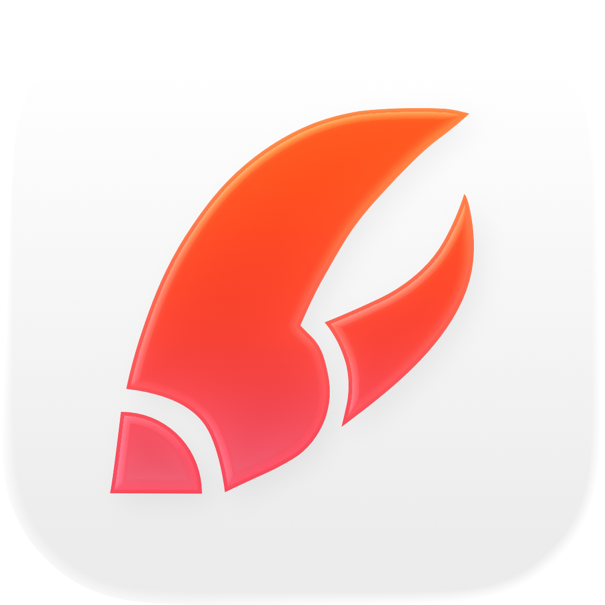

<p align="center">
  
</p>

<h1 align="center">CLiOS</h1>

<p align="center">Native iOS command center for OpenClaw AI agents.</p>

<p align="center">
  
</p>

<br>

Not a chat app. A control surface where your agent works for you, and you steer with taps and voice.

Your phone connects to an OpenClaw Gateway (VPS or Mac) over WebSocket. The agent runs on the Gateway, not on-device. CLiOS is the cockpit.

## How it works

Pair your phone by scanning a QR code or tapping a deep link (`clios://connect?host=...&port=...&token=...`). The Gateway authenticates via Ed25519 device keys stored in Keychain. Once paired, agent output streams in real time — structured cards, tasks, cron jobs, file trees — rendered natively in SwiftUI.

## Features

- **Structured cards** — agent output isn't just text. GitHub PRs, emails, calendars, checklists render as native cards with typed fields and actions.
- **Task management** — view, approve, and steer agent tasks. Background work shows real-time progress.
- **Cron jobs** — scheduled agent actions visible and controllable from the dashboard.
- **Metal shaders** — GPU-rendered animated backgrounds (aurora, plasma, rain, clouds). Shader playground in Settings.
- **Mention system** — @mention agents and tools inline with autocomplete.
- **Voice input** — dictate commands, not type them.
- **Secure pairing** — Ed25519 keypair + Keychain storage. One-time pairing, persistent sessions.

## Architecture

```
iPhone (CLiOS) <--WebSocket (port 18789)--> OpenClaw Gateway <--> AI Providers
```

~114 Swift files, ~17 Metal shaders. Key layers:

- **GatewayService** — singleton WebSocket client, single source of truth for all state
- **Card Protocol** — agent output parsed from `[card:type]...[/card]` markdown blocks into typed `ServiceCard` models
- **ChatDatabase** — SQLite (raw C API, WAL mode) for local message persistence
- **Metal shaders** — `MTKView`-backed animated backgrounds with uniform struct layout
- **FluidGradient** — CoreAnimation blob gradient system for smooth animated backgrounds

See [docs/ARCHITECTURE.md](docs/ARCHITECTURE.md) for the full protocol spec.

## Requirements

- iOS 17.0+
- Xcode 15+
- No external dependencies (no SPM, no CocoaPods)
- An OpenClaw Gateway to connect to

## Build & run

```bash
open CliOS/CliOS.xcodeproj     # then Cmd+R in Xcode
```

Or from CLI:

```bash
xcodebuild -project CliOS/CliOS.xcodeproj \
  -scheme CliOS \
  -sdk iphonesimulator \
  -destination 'platform=iOS Simulator,name=iPhone 16' \
  build
```

## Docs

| Document | Description |
|----------|-------------|
| [ARCHITECTURE.md](docs/ARCHITECTURE.md) | WebSocket protocol, pairing flow, frame format |
| [CARD-PROTOCOL.md](docs/CARD-PROTOCOL.md) | Card parsing format and capability negotiation |
| [CONNECTION-PROTOCOL.md](docs/CONNECTION-PROTOCOL.md) | Device pairing flow and auto-setup |
| [SERVICE-CARDS.md](docs/SERVICE-CARDS.md) | Supported card types and fields |
| [FEATURES.md](docs/FEATURES.md) | Full feature set |
| [VISION.md](docs/VISION.md) | Product philosophy and principles |

## Contributing

See [CONTRIBUTING.md](CONTRIBUTING.md).

## License

[MIT](LICENSE)
